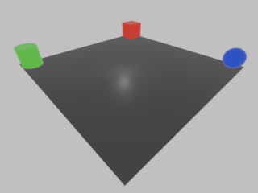

# SDK

The SDK provides headers and symbols for building custom modules. Modules are found in MODULE.BIN and contain code for
the game's rooms, AI, and certain menus. The contents of each directory are described below. This directory also
contains [PSn00bSDK](https://github.com/Lameguy64/PSn00bSDK) as a git submodule which is used for building the example
room. Finally, a tutorial for building the example room is provided at the end.

## include
These headers provide an interface into the game EXE. galerians.h just includes everything in the galerians
directory. The individual headers are described below. The actual set of types and functions defined is pretty
bare-bones at the moment, mainly just what's needed for the example room. I hope to expand this in the future.

There are a couple preprocessor symbols that you can define prior to including the headers. `GALERIANS_REGION_JAPAN`
indicates that you're building a module for the Japanese version. This is necessary because there are a few layout and
API differences between the Japanese version and other versions. `GALERIANS_USE_PSYQ` indicates that you want to build
with the PSYQ SDK. By default, the code looks for PSn00bSDK. Note that both of these symbols are currently untested.

### types.h
Types used in the game as well as flag and constant definitions. Each type has at least a brief description in the
comments, but two important types to be aware of are `GameState` and `Actor`. `GameState` describes a big singleton
object that keeps track of most global game state. Things like the current room and its contents, progression flags,
player inventory, and a whole bunch of other stuff. `Actor` represents an actor (character, including the player) in
the current room and contains information about things like their health, AI, position, and graphics.

### globals.h
Global values in memory. The two big ones are `Game` (the global `GameState` object) and `Actors` (the array of actors
in the current room). `Actors[0]` is always the player.

### api.h
Functions defined in the EXE. See the comments on each function for details of their purpose and usage. There are also
a few inline functions defined here for common operations like showing a message or setting the layout when first
loading into a room.

## ldscripts
This directory contains linker scripts for different versions of the game. Currently, scripts are only provided for the
North American (na.ld) and Japanese (jp.ld) versions, and only na.ld has been tested. The scripts are mostly symbol
definitions for globals and functions. The vast majority of symbols were dumped directly from IDA and may be
automatically-generated, speculative, or even known to be wrong but haven't been updated yet. Symbols that are defined
in the C headers should be stable, but I may rename other symbols as I learn more about them.

Aside from the symbols, the scripts also define the region in memory where the module will be loaded. Modules are
basically flat binaries, so all the input sections are packed together however the linker sees fit, with the exception
of the `MODULE_ID` section. All of the modules that ship with the game start with a unique 32-bit ID. This isn't
actually used by the game, so it's technically optional. However, the editor does expect it to be there and displays it
in the GUI. So, if you want to be able to view your room in the editor, or if you just want to be consistent with the
game's own modules, you should have a 32-bit ID in a section called `MODULE_ID` which will be placed at the beginning of
the binary.

## examples
Module example code. Currently, only an example room is provided, but I'd like to add an example AI module at some point
as well. The Makefile in the sdk root directory will build all example modules (make sure you've pulled in the
PSn00bSDK submodule). The Makefile is written for gcc; specifically, I've built it on Ubuntu with the tools from the
`binutils-mipsel-linux-gnu` package. You may need to update the `CC` and `LD` variables to point to the appropriate
compiler and linker on your platform.

## Building and using the example room
Let's see how to build the example room and patch it into the game. You'll need a copy of disc 1 of the North American
version of the game. A pre-built version of the room module is already included (ASDKX.RMD), so you can also skip the
build step and go straight to patching it into the game.

### Contents
The files for the example room are in the sdk/examples/room directory. Specifically, the input files are as follows:

- room.c: The code for the room.
- stage_a.txt: Message strings for Stage A, which is where we'll be adding the room. New messages for this room have
  been added at the end.
- test_room_320x240.png: The background image for the room's single camera angle.

The room looks like this:

Interacting with the red cube at the top will allow you to view unused item models. The green cylinder will cycle
through scan images. The blue sphere will spawn an enemy and then allow you to view an FMV. Note that I haven't taken
the time to perfectly line up the room layout with the background image, but it's close enough.

### Build
To build the example room, while in the sdk directory, first run `make clean` to get rid of the pre-built module,
then run `make`. See the notes in the [examples](#examples) section about build tools. This will create a file called
ASDKX.RMD, which is the room module. ASDKX is the room name defined in the code. Each room has a 5-character name,
which for the game's own rooms is the stage letter followed by two digits for the floor followed by two characters for
the room. The game doesn't actually use these identifiers, so in practice they can be anything. The editor will have
problems if the first character isn't the stage letter, though, so we'll adhere to that convention here. RMD is an
extension I just made up for "Room MoDule"; it's not actually significant.

ASDKX.json is a JSON file describing where various room-related data structures can be found in the modules. This file
is only necessary for the editor. When importing a module into the editor, it will automatically look for a file with
the same name but a .json extension and use that if it's found. If not, it will prompt you for the module entry point
address and then attempt to parse the relevant addresses out of the code. That's likely to fail, though, because the
parse code is tuned for the formulaic way the game's own modules set up the room layout, so it's better to provide the
JSON file. To support that, the Makefile has ld print out a listing of where everything ended up in memory which you can
use to update the JSON file.

### Patching the game
Once the room module has been built, it needs to be added to the game. If you're familiar with the game files, you can
do this with the CLI tools, but here I'll describe how to do it with the editor. I'll assume you're starting from
scratch and don't have an existing editor project.

1. Open the editor (see the Setup section in the main README).
2. Choose File > New Project and open the disc image for disc 1.
3. Choose a folder to create the project in and click Create Project (this may take a minute).
4. First, we'll add the new message strings. Go to the String tab, right-click on Stage A, and choose Import. Choose the
   stage_a.txt file from the room directory. If you open the Stage A list and scroll down to the bottom, you should see
   several entries with *'s in front of them, which are the new messages we added.
5. Next, we'll add the background image. Go to the Art tab and expand BGTIM_A. Scroll down to the bottom and right-click
   on the last entry, which should be 234.TDB. Choose "Insert after". This will open a dialog asking what type of object
   we want to insert. Everything in the BGTIM archives is a TIM DB, so choose "TIM DB" for the Type. The Name can be
   anything; for this example, I'll enter "ASDKX", the name of the room. Click OK and you'll be prompted to select the
   first image to add to the TIM DB. Choose test_room_320x240.png from the room directory. This will open the TIM Import
   dialog. For background images, BPP must be 8, Image X must be 320, and CLUT X, CLUT Y, and Image Y must be 0. You can
   choose whatever Quantization and Dithering options you prefer, although note that there currently seems to be an
   issue with the preview image not matching how the image ends up looking in-game. Also note that you need to disable
   the Transparency checkbox to have access to the full suite of Quantization options. Once you've entered the
   appropriate options, click OK. There should now be a new entry under BGTIM_A at the end called ASDKX.TDB containing
   the single image we just added.
6. Finally, we need to add the room module itself. Go to the Room tab and click the "Edit maps" button at the bottom.
   The game organizes rooms by map, so we need to choose which map to place our room in. There's a fixed amount of
   memory allocated in the EXE for these lists, so we can't add new entries without patching a lot of things in the EXE.
   Fortunately, there are unused entries where the same room is repeated multiple times, so we'll re-purpose one of
   those. If we open Hospital 14F, we can see that room A14RH is repeated in slots 14, 15, 16, and 17. We'll choose slot
   16 for our module, so click on that. On the right-hand side, click the "..." button next to the Module dropdown to
   browse for a new module to import. Choose the ASDKX.RMD module that we built. The Entry Point should be populated
   automatically from the ASDKX.json file. Click OK. If you expand Stage A, you should see our new module at the bottom.
7. Now that the module has been added, we need a way to get to it. For the purposes of this example, we'll change the
   first door you go through at the beginning of the game to go to this room instead. Still on the Room tab, open Stage
   A, open room A1501, open Triggers, and click on trigger #0, which is the activation trigger for the door. In the
   Actions section, you should see two calls to the `GoToRoom` function. Change the Map to Hospital 14F and change the
   Room to ASDKX. You'll notice that changing these arguments for one of the calls also changes them for the other call.
   That's because both of these represent the same call reached through two different code paths. The first path uses
   door sound ID 0 (the third argument) and the second path uses door sound ID 99. The other two arguments (the ones
   that we changed) are shared by both code paths.
8. Now that everything has been set up, use File > Save or ctrl+s to save the project.
9. To export the changes we've made to a playable CD image, click File > Export. This will open the Export dialog. By
   default, the export process patches changes into export/output.bin (which starts out as a copy of the CD image you
   created the project from) and saves the patched image back over export/output.bin. The "Project files" section on the
   left shows all the files that we've modified in the project, and the "Image files" section on the right shows the
   corresponding files on the CD that will be updated. As a sanity check, the modified project files should be:
   - art/BGTIM_A/ASDKX/000.TIM: The background image.
   - art/DISPLAY/005.SDB: The message file for Stage A.
   - boot/SLUS_009.86: The EXE, where the maps are defined.
   - modules/A1501.RMD: The first room in the game, where we changed the door.
   - modules/ASDKX.RMD: The new room.
10. If everything looks correct, click Export and wait for the export process to complete (this may take some time
    because we're adding new files, so the CD contents have to be shuffled around to make room). You should then be
    able to load the output.bin file in any emulator (note that Beetle PSX requires a cue sheet, which is not provided).
    Start a new game, scan the door to unlock it as usual, and you should find it now takes you to the example room.